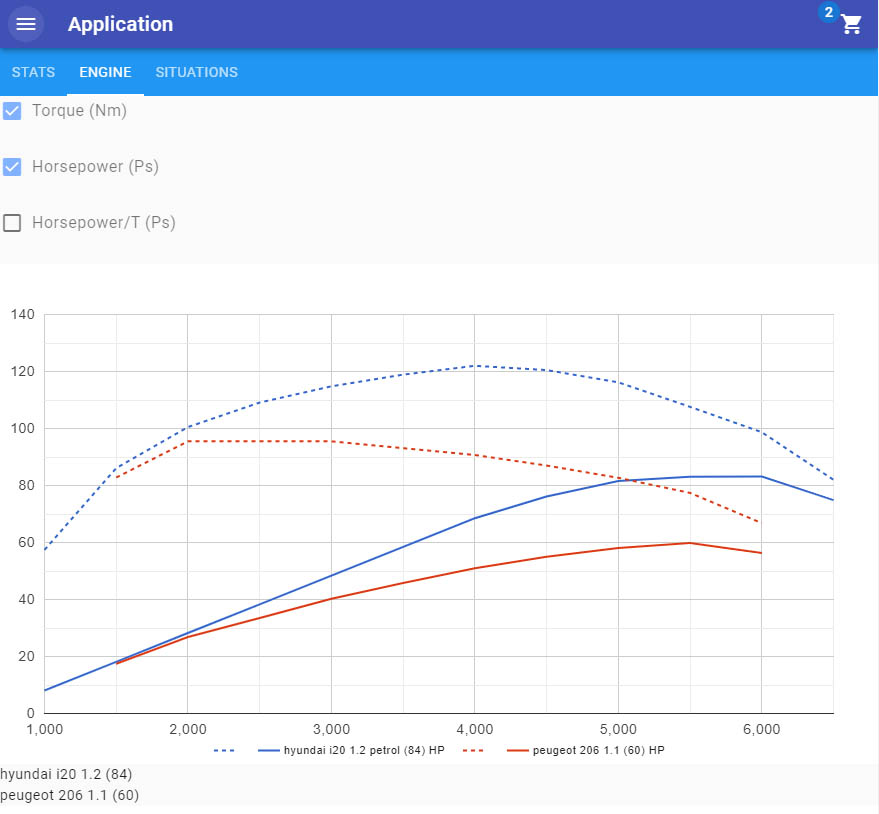

# What is it ?

Display and compare cars stats

- Engine curve compare
- Acceleration in differents situations comparison

# Vision

In the long run, this project would become a wiki where user can input car data, fix current car data if those datas are wrong and compare all the cars in the world with detailled overview and graphs in a design and functional way.

# How to install

- install postgres 9.6 & create database
- fill the .env file with your database configuration

# Developer commands
- npm run dev

### Database
- adonis make:migration
- adonis migration:run
- adonis migration:rollback
- adonis seed (--files EngineSeeder.js)

### Tests
- Create a database for tests
- Fill the .env.testing file
- Launch with adonis test or npm test

## Documentation
- [Adonis](https://dev.adonisjs.com/docs)
- [Nuxt](https://nuxtjs.org/guide)
- [Vue](https://vuejs.org/guide)

## Licenses
- [Adonis license](https://github.com/adonisjs/adonis-framework/blob/develop/LICENSE.txt)
- [Nuxt license](https://github.com/nuxt/nuxt.js/blob/master/LICENSE.md)
- [Vue license](https://github.com/vuejs/vue/blob/master/LICENSE)
